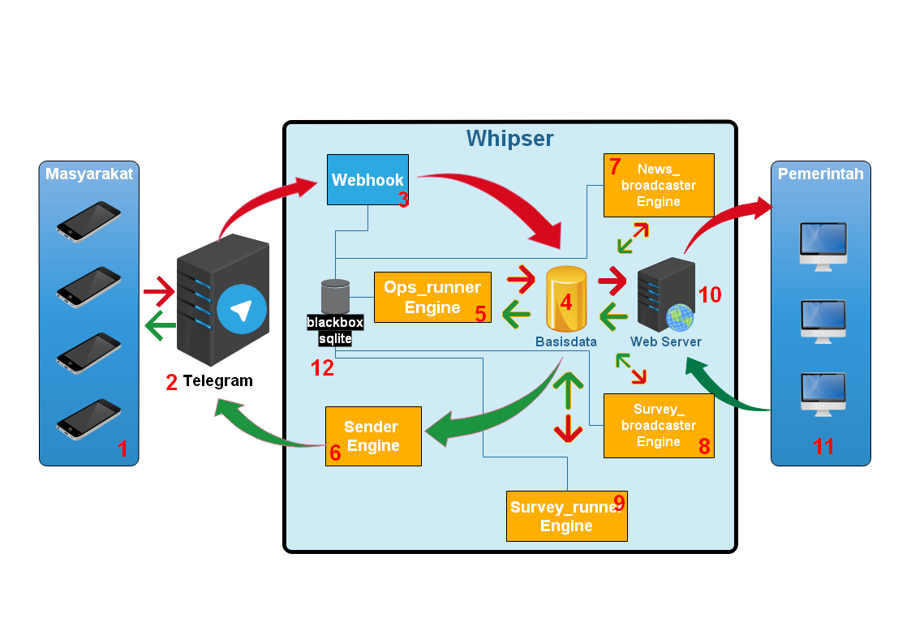
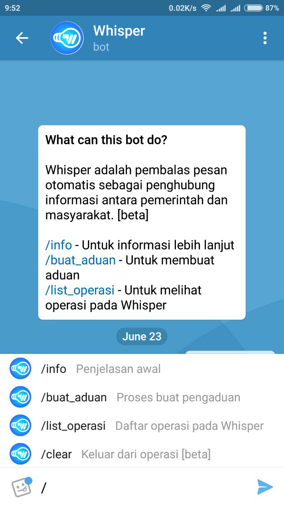
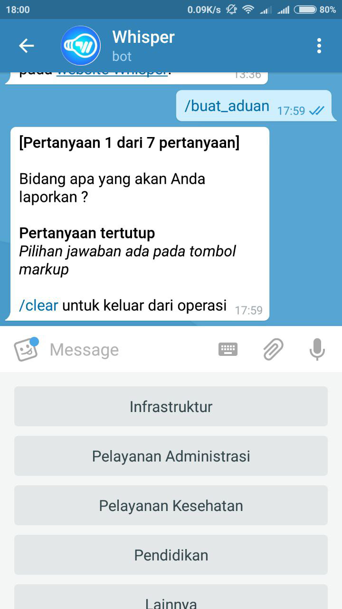
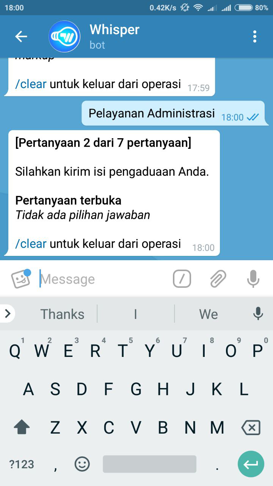
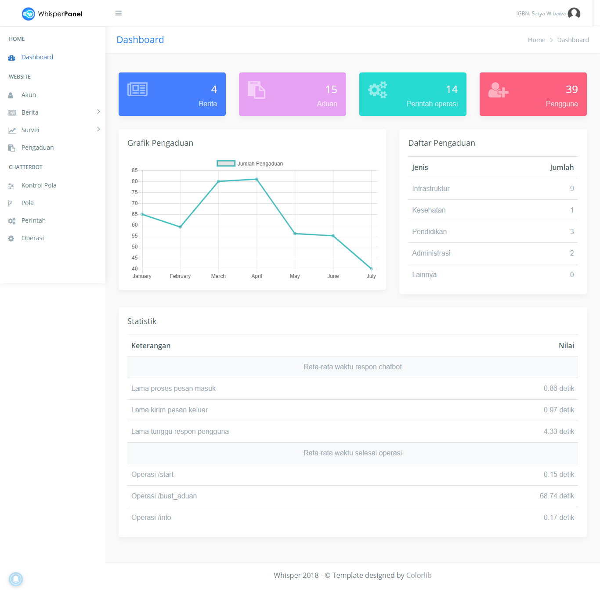

**Whisper** is an application I developed to fulfill the final project requirement of my undergraduate degree. The goal was to create a **rules-based chatbot system** that acts as a digital bridge between the general public and local government bodies. This system makes it easy for citizens to express their concerns, aspirations, or reports directly through a chatbot interface.

Whisper consists of **two main modules**:  
1. A **Telegram-based chatbot** for the public  
2. A **web-based admin portal** for government officials

Citizens can send their complaints or suggestions through the chatbot, which automatically parses and stores the information in a **MySQL database** using **Python**. Each complaint is assigned a unique **tracking number** that users can refer to for monitoring progress and status updates.

On the government side, administrators can log in through a dedicated web application to view, filter, and respond to incoming complaints. This ensures that the public can be heard and their concerns are routed efficiently to the appropriate departments.

Whisper aims to improve transparency and responsiveness by making the complaint-handling process more accessible and trackable for everyone involved.

Here are some screenshots of the application in action:

  
  
  

