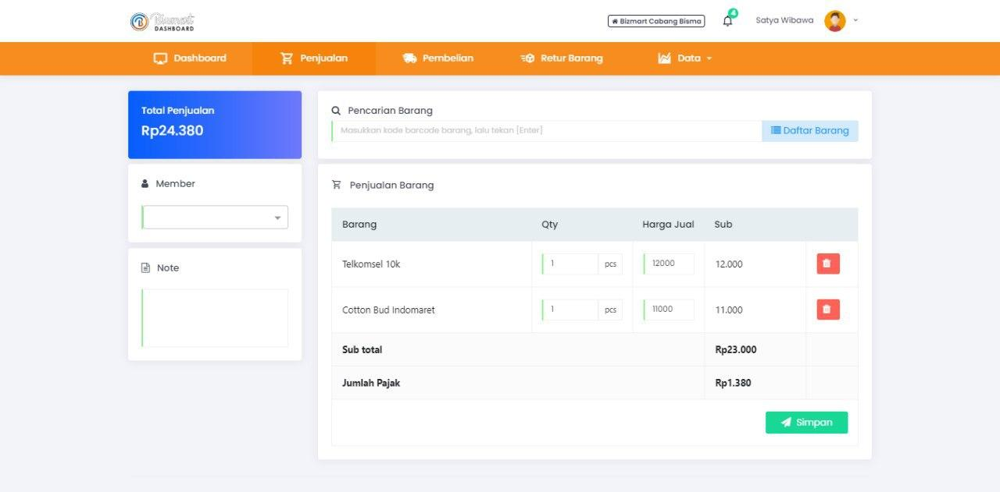

**Bizmart Point of Sale** is a comprehensive cashier application tailored for small to medium-sized retail businesses. Designed with practicality and ease of use in mind, Bizmart allows store owners and cashiers to **record transactions**, **track inventory movements**, and **analyze business performance** through well-structured reports.

The application includes key features such as:

- **Sales Recording**: Every transaction is recorded in real-time, ensuring no sale is missed.
- **Purchase Reporting**: Monitor the inflow of goods from suppliers, complete with date and value tracking.
- **Stock Flow Monitoring**: Know exactly which products are moving fast and which are underperforming with clear stock-in and stock-out summaries.
- **Sales Summary Reports**: Daily, weekly, and monthly sales summaries help users make data-driven decisions.
- **Inventory Management**: Easily view product quantities, pricing, and restocking alerts to ensure the shelves are never empty.
- **User-Friendly Interface**: Designed to be intuitive so that even non-technical users can operate it with minimal training.

Bizmart is a lightweight yet powerful solution, perfect for **minimarkets, clothing stores, electronics outlets**, and many other types of retail businesses. Its reliable reporting system helps business owners keep control of their operations and discover insights to grow revenue.

Here are some screenshots from the Bizmart app in action:

  
  

