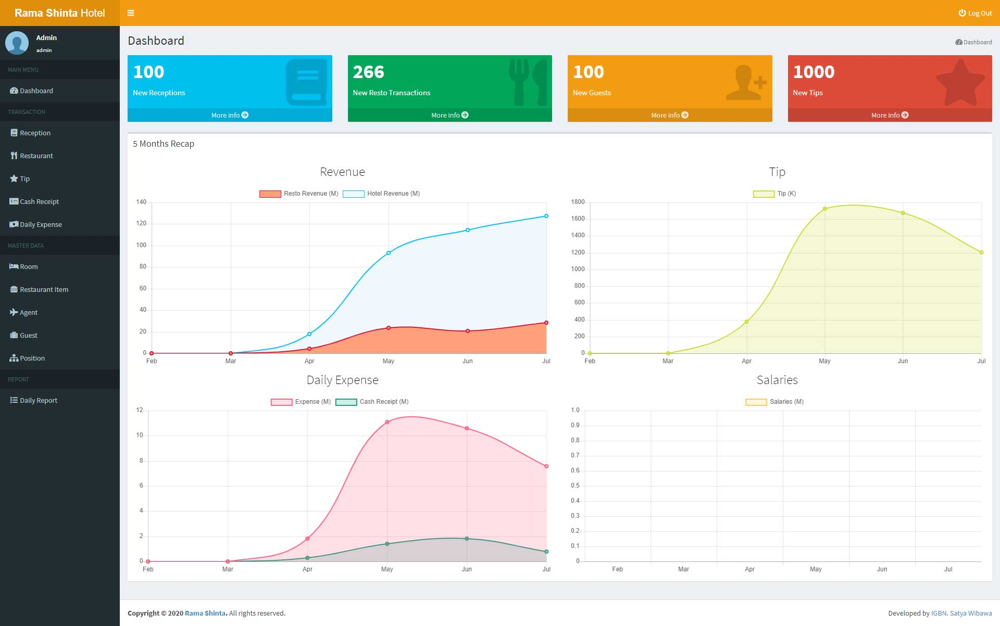
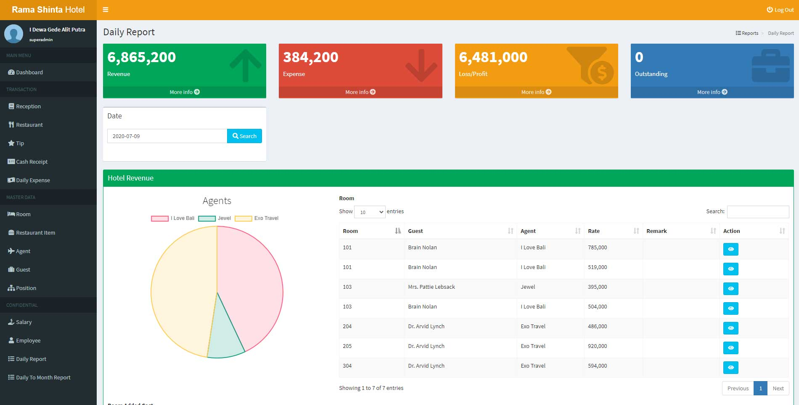

**Rama Shinta App** is a custom-built management application developed specifically for the operational needs of **Rama Shinta Hotel**, located in Candi Dasa, Bali. The main objective of this application is to **streamline the recording of financial transactions**, including both **income and expenses**, to help the hotel operate more efficiently and transparently.

The application is designed with simplicity and practicality in mind, tailored to the unique workflow of the hospitality industry, especially for small-to-mid-sized hotels that require digital transformation without excessive complexity.

## Key Features:

- **Income Recording**: Automatically tracks revenue from rooms, restaurant sales, and other services such as laundry or shuttle rentals.
- **Expense Tracking**: Enables hotel staff to input daily, weekly, or monthly operational expenses such as utility bills, salaries, groceries, and maintenance.
- **Multi-departmental Reporting**: Separates financial data for rooms, F&B (Food & Beverage), and miscellaneous income/expenses for more detailed reporting.
- **Payroll Support**: Records employee salaries and bonuses, ensuring transparency in payroll processing.
- **Complementary Management**: Allows the hotel to register and track complementary services (free of charge offerings) provided to guests, which is common in hospitality.
- **Payment Type Recording**: Supports categorization by payment method (cash, transfer, QRIS, etc.), helping reconcile with bank or cash records.
- **Insightful Dashboards**: Presents visual insights into income vs. expense trends, supporting better decision-making by hotel management.

This application is a great example of how small businesses can benefit from simple ERP-like systems tailored to their real-world operational needs without adopting large, complex software.

Here are some screenshots from the application:

  

