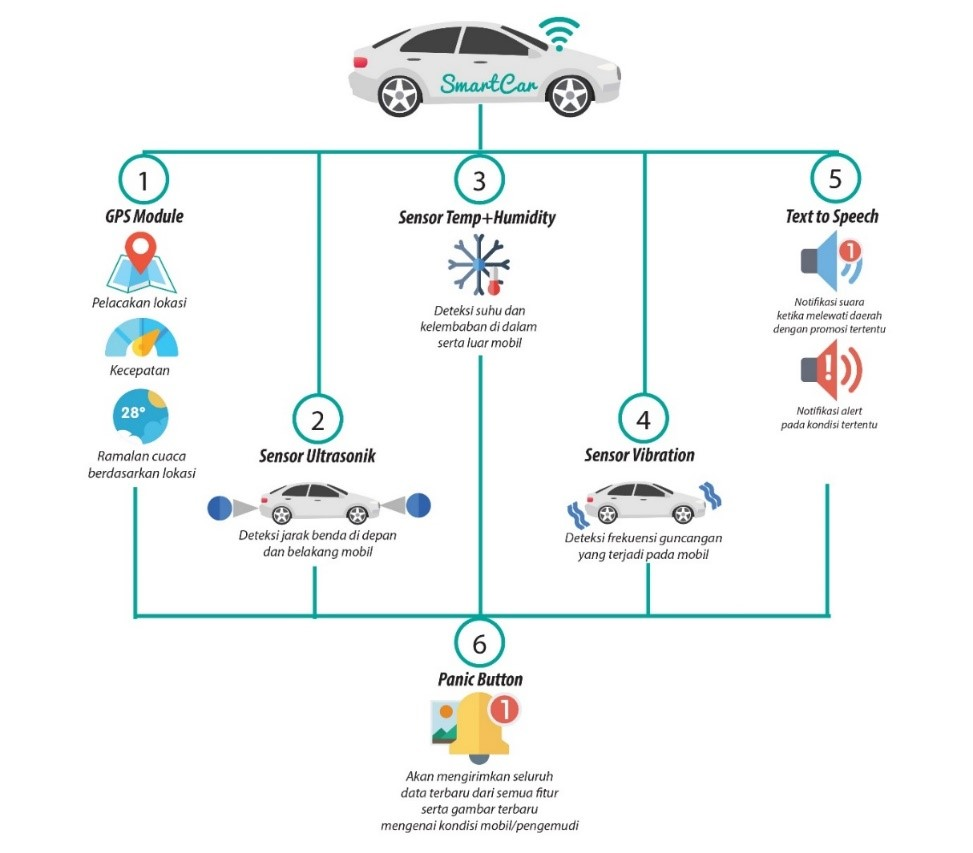

As part of the **"Topik Khusus"** course, my classmates and I developed a project involving the **Internet of Things (IoT)**. The result of this collaborative effort was a system we named **SmartCar** — a safety-focused application designed to enhance the driving experience by preventing accidents, reducing criminal risks, and allowing remote monitoring of vehicle conditions.

The **SmartCar** system was developed to provide real-time feedback to the driver, while also offering a way for third parties — such as parents or relatives — to monitor the state of the vehicle through a mobile or web interface. This system not only supports safer driving habits but also acts as a guardian against potential dangers on the road.

## Key Features of SmartCar:

1. **Location Tracking**  
   Real-time GPS tracking of the car's location, viewable through the SmartCar dashboard.

2. **Safe Distance Detection**  
   Detects the distance to the vehicle ahead to reduce the risk of rear-end collisions.

3. **Temperature & Humidity Monitoring**  
   Monitors cabin or engine temperature and humidity levels to alert users of unsafe conditions.

4. **Vibration Detection**  
   Detects unusual vibrations that could indicate sudden impacts or tampering.

5. **Notification & Promotion System**  
   Sends relevant notifications and promo messages to users based on context and location.

6. **Panic Button System**  
   When pressed, this emergency feature captures an image of the surrounding area and sends it — along with the latest data from all features — to a connected mobile or web app for immediate action.

The combination of these features transforms an ordinary vehicle into a **smart, connected, and secure system**, increasing awareness and responsiveness during driving.

For further details on how the system was planned and built, you can read our complete project documentation below:

<embed src="/files/SMARTCAR-V1.pdf" width="100%" height="500px" type="application/pdf" />

Or open it in a new tab:  
[Open SmartCar PDF](/files/SMARTCAR-V1.pdf)