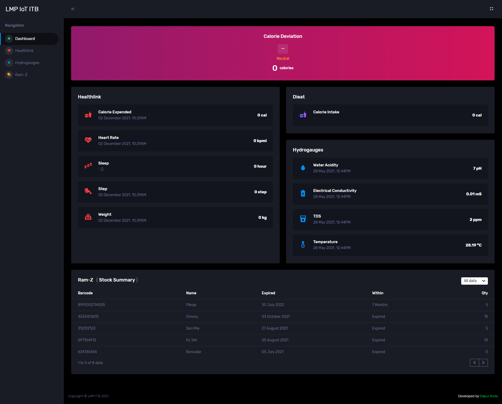
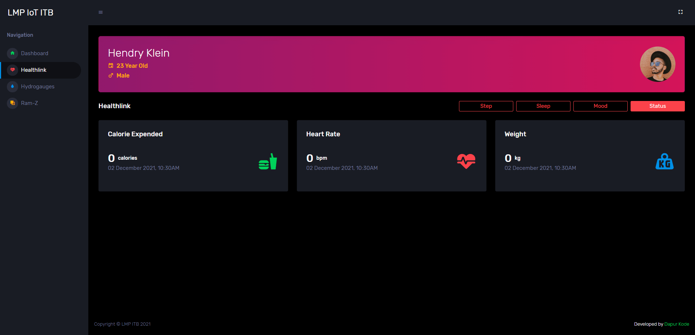
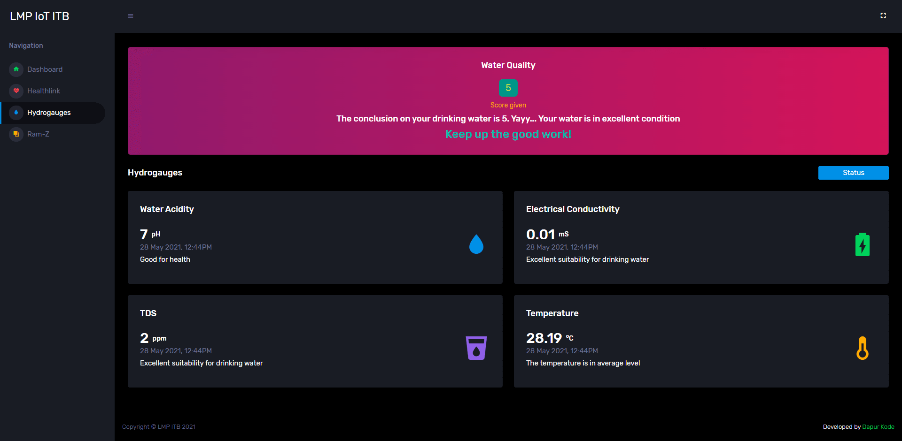

I had the opportunity to be part of a collaborative development project with **LMP ITB**, a research group under the **School of Business and Management at Institut Teknologi Bandung (ITB)**. The project focused on the prototyping of a **smart mirror** system called **Telliframe** — an innovative device that combines traditional mirrors with **Internet of Things (IoT)** functionality to deliver useful, real-time data right on the mirror’s surface.

The concept behind Telliframe is to transform everyday objects into **interactive and intelligent devices**. Positioned in homes, offices, or health facilities, the smart mirror displays personalized content such as weather updates, time, news headlines, health data, and connected device statuses — all while functioning as a regular mirror.

## Key Functionalities of Telliframe:

- **Dashboard Interface**  
  A customizable interface showing time, weather, calendar, and reminders directly on the mirror.

- **Health Monitoring**  
  Integrated with HealthLink, the system can display user health metrics such as heart rate, temperature, or step count (if connected with smart wearables).

- **Smart Home Integration**  
  Supports data from IoT-enabled home devices like **hydrogauges**, temperature sensors, and energy monitors.

- **Interactive Features**  
  Responds to voice commands or gestures (in advanced versions), allowing users to interact without physical touch.

- **Modular Application Modules**  
  Supports different app modules like news feeds, smart water usage stats, or motivational quotes.

This smart mirror prototype is part of a larger vision to bring **context-aware smart interfaces** into daily life, helping users stay informed and connected while going about their routines.

Here are some screenshots from the Telliframe application and modules:

  
  
  

